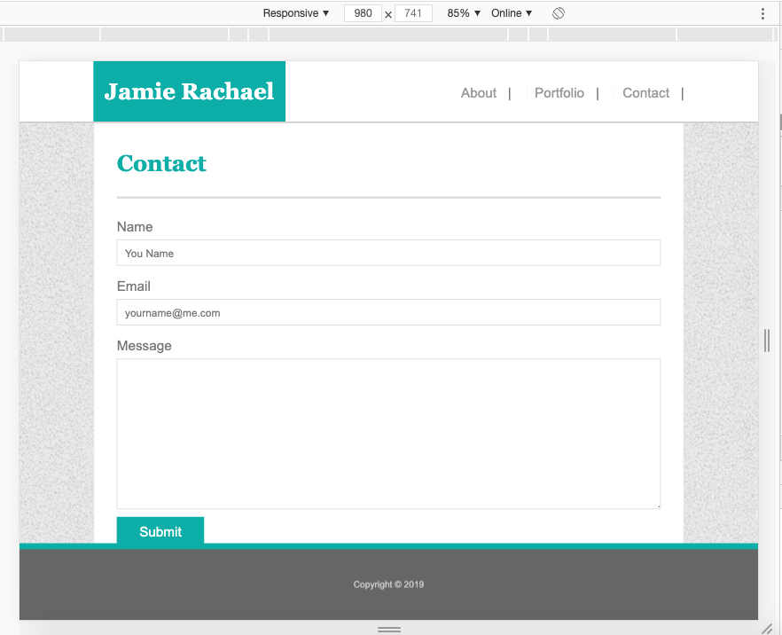

# Responsive-Portfolio
## Homework-2 Responsive-Portfolio

* [GitHub Repository](https://github.com/jamierachael/Responsive-Portfolio)
* [Deployed GitHub IO](https://jamierachael.github.io/Responsive-Portfolio/)
* [Full Demo Video](https://drive.google.com/file/d/1pT5WcVQmhtRmccelCtPIRRmvAw7Paul6/view)

### Summary
* HTML and CSS documents built from a previous project
* This project emphasizes the use of repsonsive design using CSS Media Queries 

### This project has media Queries for:
* max-width: 980px 
    * Adjusts widths and margins
    * Moves Nav

    
    
    
* max-width: 786px
    * Adjusts widths and margins
    * Moves Nav
    * Resizes img on portfolio page and their associated headings
* max-width: 640px
    * Adjusts widths and margins
    * Moves Nav
    * Resizes img on portfolio page and their associated headings
    * Resizes footer
    * Resizes Header, changes position to static

### To Execute File:
> Open in browser

### Features: 
* Three HTML Pages
    * Index.html
        * contains personal bio
    * Portfolio.html 
        * contains work examples with headings highlighting services offered
    * Contact.html
        * Contains a customer interest contact form
* Two CSS Pages
    * Styles.css
        *Main styles sheet
    * Reset.css 
        * Clears default browser styling

### Code Validation 
    * These use W3C Code Validators for HTML and CSS
    * Please provide feedback whether this image syntax is correct
        * Format: 
        * Format: 
        * Format: 
        * Format: 

