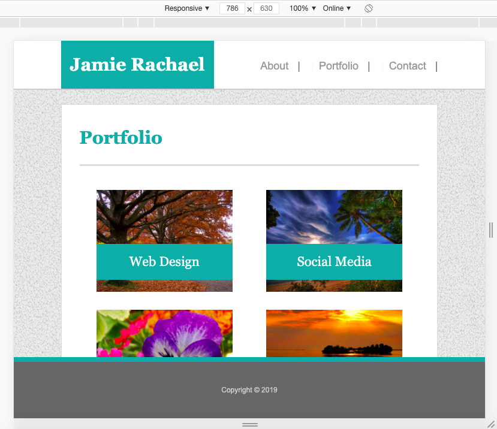
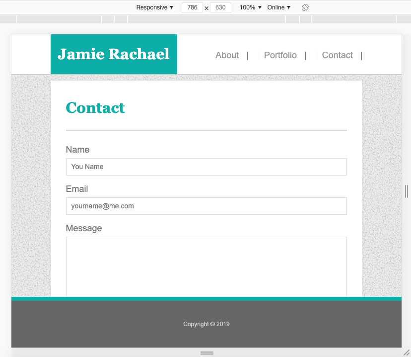
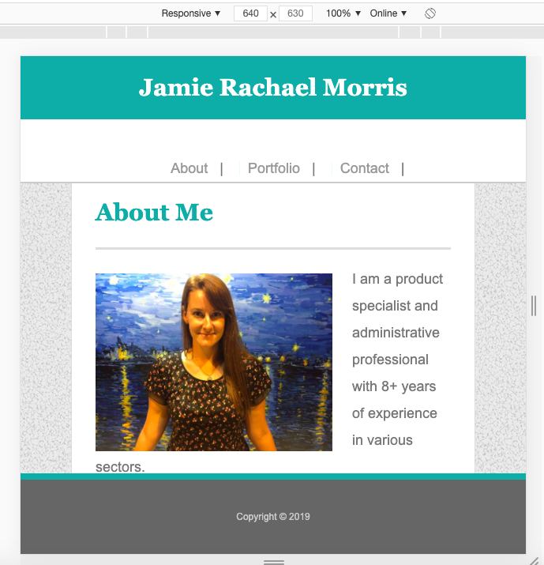
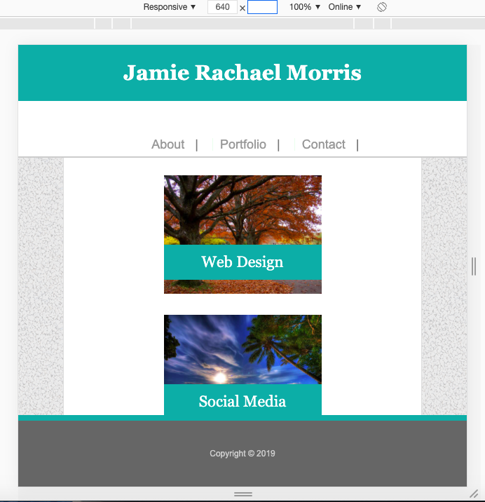

# Basic-Portfolio

This project was designed as a homework assignment for UNH's coding bootcamp. This emphasizes modifying an exisitng website template build in HTML and CSS to have responsiveness using CSS media queries. 

Layout and content were built using HTML and CSS using Visual Studio Code editor.

This project has been deployed to GitHub Pages. To get this project up and running, you can follow the deployment link. Or, download the sources files to use this as a template.

* [GitHub Repository](https://github.com/jamierachael/Responsive-Portfolio)
* [Deployed GitHub IO](https://jamierachael.github.io/Responsive-Portfolio/)
* [Full Demo Video](https://drive.google.com/file/d/1pT5WcVQmhtRmccelCtPIRRmvAw7Paul6/view)

### Prerequisites

To install this application, you will need a text editor. I recommend Visual Studio Code. 

### Installing

To install this code, download the zip file, or use GitHub's guidelines to clone the repository. 

## Project Requirements 

This project provides a responsive template for a portfolio website. 

Pages include the following: Index, Portfolio, Contact with media queries for screensizes 980px, 786px, 640px. 

### Summary
* HTML and CSS documents built from a previous project
* This project emphasizes the use of repsonsive design using CSS Media Queries 

### This project has media Queries for:
* max-width: 980px 
    * Adjusts widths and margins
    * Moves Nav

    
    
    
* max-width: 786px
    * Adjusts widths and margins
    * Moves Nav
    * Resizes img on portfolio page and their associated headings

    
    
    
* max-width: 640px
    * Adjusts widths and margins
    * Moves Nav
    * Resizes img on portfolio page and their associated headings
    * Resizes footer
    * Resizes Header, changes position to static

    
    
    

### To Execute File:
> Open in browser

### Features: 
* Three HTML Pages
    * Index.html
        * contains personal bio
    * Portfolio.html 
        * contains work examples with headings highlighting services offered
    * Contact.html
        * Contains a customer interest contact form
* Two CSS Pages
    * Styles.css
        *Main styles sheet
    * Reset.css 
        * Clears default browser styling

## Authors

* **Jamie Rachael Morris** - *Initial work* - [Git Hub Profile](https://github.com/jamierachael)
* UNH Project Design

## Acknowledgments

* Hat tip to UNH for providing project parameters and code examples

